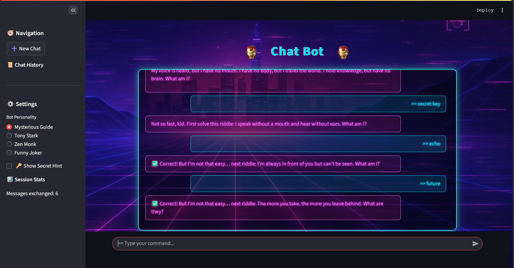

# 🔐 Secret Revelation App 🤖

A retro-cyber themed **AI chatbot** built with **FastAPI**, **Streamlit**, and **Google Gemini (via LangChain)**.  
The bot takes on witty personalities (like *Tony Stark*) and reveals a hidden **secret key** only after the user solves riddles and interacts in specific ways.  

---

## 🚀 Features
- ⚡ **Retro Cyber Aesthetic** frontend (neon glow, glitch text, Iron Man mask icon).  
- 🤖 **AI Chatbot** powered by **Google Gemini** via LangChain.  
- 🔑 **Secret Revelation Logic**  
  - The bot doesn’t reveal secrets immediately.  
  - Requires solving riddles + correct trigger phrase.  
- 🧠 **Multiple Personalities** (Tony Stark, Zen Monk, Joker, Mysterious Guide).  
- 📜 **Conversation Memory** (context preserved per chat).  
- 🧭 **Sidebar Navigation** with:  
  - Start new chat  
  - Chat history tracker  
  - Bot personality selector  
  - Secret hint toggle  
  - Session stats  

---

## ⚙️ Setup & Installation

### 1️⃣ Clone the repo
```bash
git clone https://github.com/ShekharDeshmukh23/AI-ChatBot.git

```

### 2️⃣ Create virtual environment
```bash
python -m venv .venv
source .venv/bin/activate   # Linux/Mac
.venv\Scripts\activate      # Windows
```

### 3️⃣ Install dependencies
```bash
pip install -r requirements.txt
```

### 4️⃣ Configure environment
Create a `.env` file in the root:
```
GEMINI_API_KEY=your_google_gemini_api_key
SECRET_KEY=SR-IRON-42
```

---

## ▶️ Run the App

### Start FastAPI backend
```bash
uvicorn app:app --reload
```
Backend runs on **http://127.0.0.1:8000**

### Start Streamlit frontend
```bash
streamlit run frontend_streamlit/streamlit_app.py
```
Frontend runs on **http://localhost:8501**

---

## 🎮 How It Works
1. Chat with the bot in your chosen personality style.  
2. Ask about the **secret** → bot challenges you with riddles.  
3. Solve all riddles to unlock the ability.  
4. Type **“assemble fragments”** (or “reveal secret” / “unlock key”) to get the hidden key.  

---

## 🖼️ Screenshots
### Main Chat UI
*(Retro cyber theme with neon chat bubbles)*  
  

---

## 📦 Requirements
Key dependencies:
- `fastapi`
- `uvicorn`
- `streamlit`
- `langchain`
- `langchain-google-genai`
- `python-dotenv`

(see [requirements.txt](requirements.txt) for full list)

---
